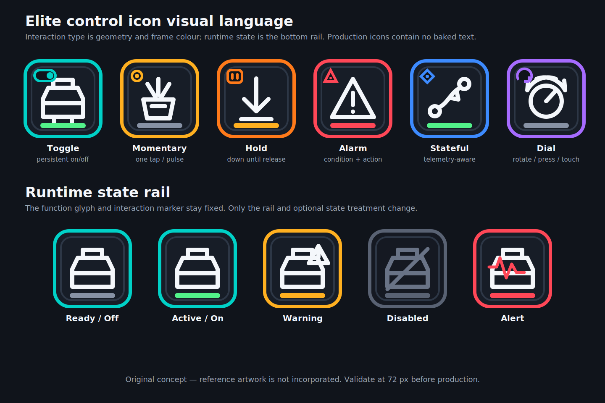

# Icon design system

## Status

This document defines the proposed visual language for original Linux plugin
icons. The concept is not yet approved for production and no complete runtime
icon set exists.



## Decision and provenance

Create an original vector-native icon system rather than shipping or tracing the
legacy example images or the `muzll0dr/elite-streamdeck-icons` reference set.
The latter has useful visual cues but no explicit licence and states that some
resources were borrowed from `edassets.org`. Treat it as research material only
unless its complete redistribution and derivative-work provenance is resolved.

Keep editable SVG masters and render raster sizes from them. Do not use
independently generated raster art as the production source: repeated geometry,
state variants, small-size legibility, and future revisions need deterministic
assets.

Before release, choose and record the licence for the new artwork, its authors,
the Frontier media disclaimer if applicable, and every incorporated third-party
element in `attribution.json`.

### EDAssets reference audit

[EDAssets](https://edassets.org/) is a useful catalogue of Elite Dangerous
visual vocabulary, but it is not an approved source of production artwork for
this project. The current site is a JavaScript front end backed by the
[Venefilyn/EDAssets repository](https://github.com/Venefilyn/EDAssets), formerly
`SpyTec/EDAssets`. The repository's latest commit is dated 2020-11-30.

The repository has an MIT licence for its software and associated
documentation. That must not be assumed to grant unrestricted rights to every
catalogued image. The site's About page separately says its Elite Dangerous
assets and imagery were used with Frontier Developments' permission for
non-commercial purposes. The requested image categories are marked `fanmade`
and credit CMDR SpyTec in the catalogue data, but there is no per-asset licence
or redistribution notice alongside the downloaded PNG and SVG files. Therefore
do not copy, trace, modify, bundle, or use those files as SVG components unless
the relevant author and Frontier permissions are resolved in writing.

The inspected categories remain useful as a requirements index:

<!-- markdownlint-disable MD013 -->

| Catalogue section | Contents | Design implication |
| --- | --- | --- |
| [NPC commands](https://edassets.org/#/npccommands) | eight fighter orders: attack, defend, engage, follow, hold, formation, recall, and switch | reserve a coherent fighter-order family in the curated Static glyph library; use direction, formation, and target primitives that remain distinct at 72 px |
| [Fonts](https://edassets.org/#/fonts) | external references to Century Gothic, Euro Caps, Eurostile Roman, Sintony, and Telegrama; EDAssets does not distribute the fonts | do not adopt a font merely because it appears here; production icons remain text-free and any project font needs its own current licence audit |
| [Engineer effects](https://edassets.org/#/engineers/engineereffects) | nineteen effect symbols covering damage, disruption, reboot, breach, regeneration, mass lock, and thermal attack | use the concepts to test warning, alert, degraded, and recovery overlays; do not add effect-specific icons unless a ported action exposes the state |
| [CQC](https://edassets.org/#/cqc) | objective, friendly/enemy, shield, speed, stealth, and weapon concepts plus CQC branding | use these as a semantic checklist for generic target, allegiance, defence, motion, visibility, and weapon glyphs; exclude logos and rank/brand marks from the base system |
| [Wings](https://edassets.org/#/wings) | four numbered wing-member emblems | support a reusable group/member glyph with a dynamic number or label rather than four baked variants |

<!-- markdownlint-enable MD013 -->

This audit reinforces the original-artwork decision. Semantic ideas such as
"shield", "formation", or "engine disruption" are requirements; EDAssets'
particular paths, silhouettes, proportions, and compositions are reference
artwork and must not become the drawing template. A visual review also shows
that the catalogue mostly supplies standalone function or emblem glyphs, not a
consistent encoding of interaction type and live/degraded state. The project's
separate function, interaction, and state layers therefore remain necessary.

## Visual grammar

The system separates three meanings:

1. **Function glyph** — what Elite operation the action controls.
2. **Interaction marker and frame** — how the deck control behaves.
3. **State rail and treatment** — what the backend currently knows about it.

Do not rely on colour alone. Interaction types have both a distinct marker and
accent colour; disabled and alert states add geometry as well as colour.

<!-- markdownlint-disable MD013 -->

| Interaction type | Marker | Frame accent | Meaning |
| --- | --- | --- | --- |
| Toggle | split switch pill | teal | persistent on/off control |
| Momentary | dot inside ring | amber | one tap or command pulse |
| Hold | paired vertical bars | orange | key down until release/cancel |
| Alarm | warning triangle | red | condition indicator plus command |
| Stateful | diamond with centre point | blue | telemetry-dependent command/display |
| Dial | circular arrow | violet | rotate, press, or touch interaction |

| Runtime state | Rail/treatment | Meaning |
| --- | --- | --- |
| Ready/off | neutral slate rail | usable but inactive |
| Active/on | green rail | active or selected |
| Warning | amber rail plus warning mark | usable with caution or notable condition |
| Disabled | grey glyph/frame plus diagonal slash | action currently unavailable |
| Alert | red rail plus pulse/alert geometry | immediate alarm condition |
| Degraded | broken/dotted rail plus source marker | required telemetry is stale or unavailable |

<!-- markdownlint-enable MD013 -->

Production icons should be glyph-first and contain no baked labels. Let
StreamController render optional localized labels. Fire-group letters, route
counts, limpet counts, and pip values are dynamic overlays rather than separate
artwork.

## Drawing constraints

- author square masters on a `256 x 256` SVG view box;
- retain a 24 px safe area and a consistent 10 px primary stroke;
- use round caps/joins and avoid detail that disappears at 72 px;
- use a near-black tile, off-white glyph, and WCAG-conscious accent contrast;
- ensure every state remains distinguishable in greyscale;
- validate square icons at 256, 144, and 72 px;
- create separate wide compositions for Stream Deck + dial displays instead of
  stretching square icons;
- keep function glyphs, interaction markers, frames, and state treatments as
  composable layers.

## Coverage plan

### Required shell and health assets

- plugin, category, and action-picker icons;
- backend healthy, starting, degraded, and failed;
- missing path, missing binding, stale telemetry, and input unavailable.

### Stateful action assets

- toggles: analysis mode, cargo scoop, flight assist, galaxy map, hardpoints,
  landing gear, lights, night vision, silent running, system map, SRV drive
  assist, SRV handbrake, SRV turret, and panel focus;
- power: reset, systems, engines, and weapons, with normal/four-pip/alarm
  treatments generated as state overlays;
- alarms: highest threat, chaff, heat sink, and shield cell bank;
- FSS and hyperspace/FSD: engaged, enabled, and disabled treatments;
- route: available and unavailable, with remaining jumps rendered dynamically;
- limpet: generic, collector, and prospector glyphs, with count rendered
  dynamically;
- fire group: one reusable glyph with dynamic group label and
  selected/unselected/disabled treatments;
- generic dial and fire-group dial, including a wide dial-display composition.

### Curated static glyph families

- fighter orders: attack target, defend, engage, follow, hold formation,
  maintain formation, recall, and switch control;
- target and allegiance: objective, friendly, hostile, wing, and wing member;
- ship condition: shield, hull, engine, FSD, sensor, thermal, and recovery;
- performance and combat: speed, stealth/visibility, and weapons.

These are visual coverage families, not newly promised actions. Add them when a
ported action or common Static binding needs them, and draw each from the
project's own geometric primitives.

### Static action policy

The legacy Static and Repeating Static registries are too broad for a separate
baked icon for every Elite binding. Provide:

- generic Momentary and Hold bases;
- a curated library of common function glyphs;
- optional user-selected media;
- label overlays supplied by StreamController.

Add a new glyph when a function is common or visually ambiguous, not merely
because a binding name exists.

## Naming contract

Use lowercase kebab-case and keep interaction, function, and state explicit:

```text
toggle-landing-gear--off.svg
toggle-landing-gear--on.svg
toggle-landing-gear--disabled.svg
alarm-heat-sink--ready.svg
alarm-heat-sink--alert.svg
dial-fire-group--base.svg
```

Generated PNGs use the same basename. Dynamic renderers should select semantic
states (`ready`, `active`, `warning`, `disabled`, `alert`, `degraded`) rather
than embed filenames throughout action classes.

## Approval gate

Before producing the complete set, review the concept at physical-deck scale:

1. interaction type is recognizable without reading a label;
2. off versus disabled and warning versus alert are unmistakable;
3. glyphs remain legible at 72 px;
4. colour-blind and greyscale views preserve meaning;
5. the visual style is original and the provenance record is complete.
